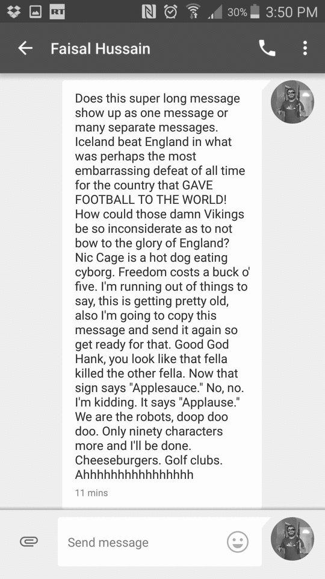

# What is conversational blogging?

**Conversational Blogging**  
_noun._  
Chronologically stored entries in a website as a means for structured conversation  
Source: [1](https://www.youtube.com/watch?v=dQw4w9WgXcQ)  

> Okay, I'll admit it. I just made that up.

# Purpose
I want to have thoughtful well structured conversation with my friends that I frequently see.  
  
Instant messaging sucks! It's great for figuring out who's in town or setting up dinner plans. Maybe even figuring out why that friend of yours is late. But writing a lengthy meaningful peice is a disaster. The much dreaded wall-of-text is an eye sore and clearly uninviting for the reader.  
  
Let's bring back the days of snail mail and pen pals. No more convoluted wall-of-texts. No more rushing to splurt out dilute thoughts. Let's brew some rich discussions with the help of modern blog formatting.

  
Exhibit. A: The dreaded wall of text  

# How to make it work
1. Keep it super simple
  a. Markdown format for blog posts
  b. Use service like Jekyll for blog post
  c. Offer response to previous blog post
  d. Keep the discussion alive (either a segue or a new topic)
  e. A reponse once a month should suffice
  

I don't think I've ever seen anything like this before.  
It's highly experimental so I'd like to see if this works out.  
I'll gladly accept any input.  
